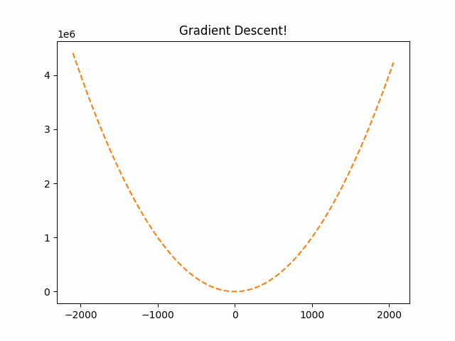

# Gradient-Descent-Visual
Changing the function and derivative functions will return gif showing the steps of Gradient Descent.

This is a min finding algorthim that is used alot in AI for SGD models.

This will return a animation showing the steps that Gradient Descent will take to find the root.

<div align="center">
  Example Run.
  
  

</div>

## How to Run
1. Change function and derivative in code 

2.
```
 python Gradident.py 

```


